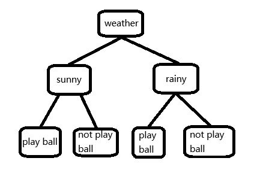
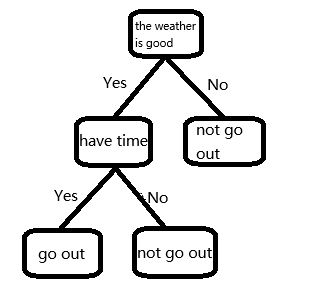

## Decision Trees
A **Decision Tree** is an algorithm that mimics the human decision-making process. Starting from a "Root Node" at the top, it performs a series of "Yes/No" style judgments based on data features, eventually reaching a conclusion at the "Leaf Nodes".


### Structure
A decision tree consists of 3 parts:
- **Root Node**: The starting point containing the entire sample set; it represents the first feature used for splitting.
- **Internal Nodes**: Represent a test on a feature or attribute (e.g., "Is the temperature higher than 30°C?").
- **Leaf Nodes**: The final output result (class or value), where no further splitting occurs.




### Construction
The core of building a decision tree is **selecting the optimal features for partitioning**. Common metrics include:
- **Information Gain**: Based on **Entropy**. The higher the entropy, the more disorder there is; the algorithm aims to reduce entropy.
- **Gini Impurity**: Measures the probability of two randomly selected samples belonging to different categories. A lower Gini impurity indicates higher sample purity (commonly used in the CART algorithm).
- **Mean Squared Error (MSE)**: Commonly used for regression trees, aiming to reduce the deviation between predicted and actual values.

[Image illustrating Entropy and Gini Impurity in decision trees]

> In the context of decision trees and information theory, **Entropy** is a measure of "disorder" or "uncertainty" in a system.
> Simply put: Higher entropy means the information is cluttered; lower entropy means the information is pure.

### Pros and Cons
**Advantages**:
- **High Interpretability**: Unlike neural networks, you can see exactly how the model makes decisions at a glance.
- **Minimal Preprocessing**: Not sensitive to missing values and does not require data standardization like linear regression.
- **Non-linear Modeling**: Capable of capturing complex non-linear relationships between features.

**Disadvantages**:
- **Overfitting**: The tree may try to "memorize" every detail; if the tree is too deep, it performs poorly on new data.
- **Sensitive to Noise**: Vulnerable to noisy data, which can lead to a decline in model performance.
- **Instability**: Small changes in the data can lead to the generation of a completely different tree.

## Example
Install the dependency library:
```bash
pip install scikit-learn
```

Load the dataset (scikit-learn comes with the Iris dataset):
```python
from sklearn.datasets import load_iris
from sklearn.model_selection import train_test_split
from sklearn.tree import DecisionTreeClassifier
from sklearn.metrics import accuracy_score
import pandas as pd

# Load the Iris dataset
iris = load_iris()
X = iris.data
y = iris.target

# Split the dataset into training and testing sets
X_train, X_test, y_train, y_test = train_test_split(X, y, test_size=0.3, random_state=42)

# Print the data
df = pd.DataFrame(X, columns=iris.feature_names) # Physical dimensions of the Iris flowers
df['target'] = y # 0, 1, 2 represent 3 different species
print(df.head()) # Print the first five rows
```

Training:
```python
# Create a Decision Tree Classifier
clf = DecisionTreeClassifier()

# Train the model
clf.fit(X_train, y_train)
```

Prediction and Evaluation:
```python
# Make predictions on the test set
y_pred = clf.predict(X_test)

# Calculate accuracy
accuracy = accuracy_score(y_test, y_pred)
print(f"Model Accuracy: {accuracy:.2f}")
```

Output:
```
Model Accuracy: 1.00
```

## Resources
[Runoob: Decision Tree](https://www.runoob.com/ml/ml-decision-tree.html)  
[Kaggle](https://www.kaggle.com/code/dansbecker/basic-data-exploration)