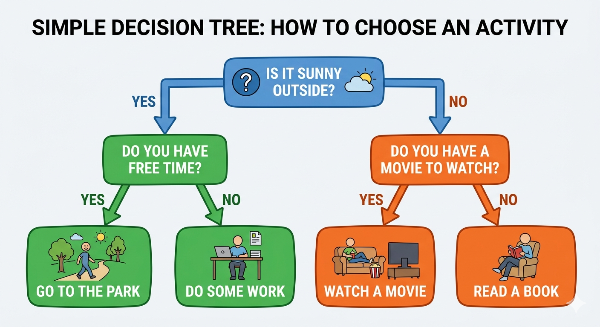

# Intro to Machine Learning

## Task 3.1: Read Course Materials

- [x] Navigate to `intro-to-machine-learning/`
- [x] Open `README.md`
- [x] Read the course structure overview
- [ ] Take notes on key concepts
- [ ] List 3 things you want to learn

---

### What are the key concepts?

1. a model: basically a mathematical formula or algorithm that takes data and learns patterns to predict output like label. basically system that makes decision based on your data.

2. features and labels: features are input and labels are output.

3. training data: data you feed into the model so it can learn relationship between inputs and the correct outputs.

4. testing data: new data then the training data.

5. overfitting: too good at something that they are bad at other new datas.

6. bias and variance: bias is when the model is too simple and variance is too complex.

7. hyperparameters: setting you choose before training.

---

### what are the keywords in ai learning

1. Neural network:
2. Learning rate
3. Layers
4. Epochs
5. Loss function
6. Gradient descent
7. Features
8. Labels
9. Training data
10. Testing data

---

## Task 3.2: Study Decision Trees

- [x] Open `intro-to-machine-learning/LYGreen/machine-learning-2.md`
- [x] Read about Decision Trees
- [ ] Draw a simple decision tree on paper (e.g., for predicting house prices)
- [x] Note down: What is a decision tree? (write 2-3 sentences)

---

### Decision Tree

*copyed from /LYGreen/intro-to-machine-learning/2-basic-data-exploration/machine-learning-2.md*

```defination
## Decision Trees
A **Decision Tree** is an algorithm that mimics the human decision-making process. Starting from a "Root Node" at the top, it performs a series of "Yes/No" style judgments based on data features, eventually reaching a conclusion at the "Leaf Nodes".
```



1. Root - top node
2. internal (decision) nodes - middle nodes
3. leaf - end node

Desicion tree basically yes and no until you come to a conclution of the decision.
